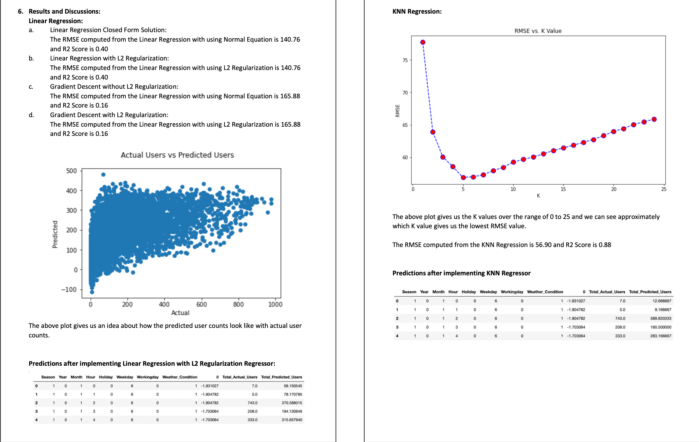
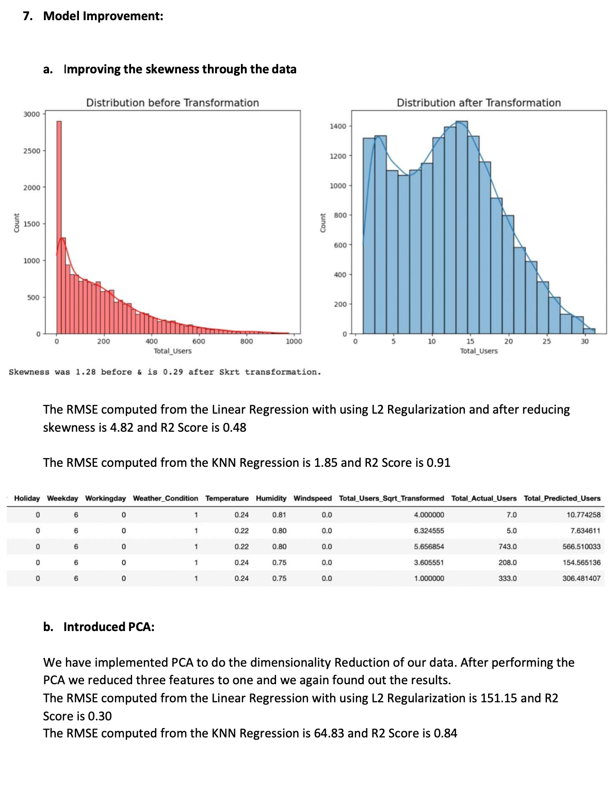

# Bike Rental Demand Forecasting using Machine Learning in Python

This project aims to predict the number of bike rentals based on various attributes using regression analysis. We analyzed the Rental Bike Sharing Dataset from 2011 and 2012 to develop a regression model that accurately predicts rental counts. The ultimate goal is to help bike-sharing companies optimize their inventory and pricing strategies.

## Table of Contents
1. [Abstract](#abstract)
2. [Introduction](#introduction)
3. [Data Description](#data-description)
4. [Dataset Information and Null Values Check](#dataset-information-and-null-values-check)
5. [Problem Solving Methods](#problem-solving-methods)
6. [Exploratory Data Analysis](#exploratory-data-analysis)
7. [Results and Discussions](#results-and-discussions)
   - [Linear Regression](#linear-regression)
   - [KNN Regression](#knn-regression)
8. [Model Improvement](#model-improvement)
9. [Conclusion](#conclusion)

## Abstract 

This project utilizes regression analysis to predict bike rentals based on the Rental Bike Sharing Dataset. It involves data cleaning, exploratory data analysis, feature engineering, and model development using regression techniques. The goal is to build a robust and accurate regression model for forecasting bike rentals.

## Introduction 

Bike sharing systems have gained popularity in urban areas, generating data that can provide insights into travel patterns and behaviors. The Rental Bike Sharing Dataset from 2011 and 2012 contains information related to weather, holidays, and bike usage, offering rich data for analysis.

## Data Description 

The dataset contains information on bike rentals in Washington D.C. for the years 2011 and 2012. Analyzing this data can help identify popular routes and locations, understand how different factors influence travel behavior, and support transportation planning and policy decisions.

## Dataset Information and Null Values Check 

We performed a null values check and a heatmap visualization to assess the relationships between various features and the target variable 'Total_Users.' We identified features that correlate with bike rentals, such as Season, Hour, and Temperature.

## Problem Solving Methods 

Two regression methods, Linear Regression and KNN Regression, were employed to predict bike rentals.

### Linear Regression
- Linear Regression with Closed Form Solution
- Linear Regression with L2 Regularization (Ridge Regression)
- Gradient Descent without L2 Regularization
- Gradient Descent with L2 Regularization (Ridge Regression)

### KNN Regression
K-Nearest Neighbors (KNN) regression was utilized to predict bike rentals based on the proximity of data points in the feature space.

## Exploratory Data Analysis 

Various visualizations were created to understand user count distributions across different factors, including time, seasons, and weather conditions.

## Results and Discussions 

Results from both Linear Regression and KNN Regression were evaluated, and predictions were visualized. Various model variations were explored to determine the most effective approach.

## Model Improvement 

Attempts to improve the model included addressing skewness, feature engineering, and introducing Principal Component Analysis (PCA). The impact of these changes on model performance was assessed.

## Conclusion 

The project aimed to predict bike rentals using regression models. The KNN Regressor emerged as a reasonable baseline model for this use case. Although preprocessing and feature engineering were attempted, improvements were limited. Alternative regression models and approaches like hyperparameter tuning may yield better results. Outliers were retained as they may contain valuable information for the model.

For the detailed implementation and code, please refer to the Jupyter Notebook in this repository and [Report](Report/Final%20Project%20Report.pdf).

## About the Authors

- Saloni Bhutada 
- Aman Maheshwari

## Acknowledgments

Special thanks to Capital Bikeshare system of Washington D.C. for providing valuable data for this analysis.

Feel free to explore the Jupyter Notebook for in-depth details and code implementation. Your contributions and feedback are always welcome. Enjoy exploring the world of bike rental predictions!
